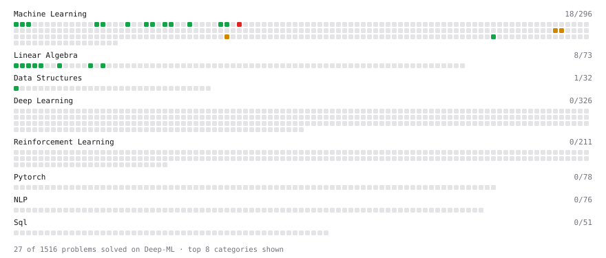

# Deep-ML

My machine learning practice from [Deep-ML](https://www.deep-ml.com). Every solution here was written by hand.

**39** solved · 29 problems · 2 labs · 8 math

[**Browse the interactive portfolio**](https://yannal438.github.io/deep-ml/) to replay this filling in over time.

## Problems

| | Difficulty | Solved | |
| --- | --- | --- | --- |
| [Binary Classification with Logistic Regression](https://www.deep-ml.com/problems/104) | easy | 2026-10-01 | [solution](problems/0104-binary-classification-with-logistic-regression) |
| [Calculate 2x2 Matrix Inverse](https://www.deep-ml.com/problems/8) | easy | 2026-09-29 | [solution](problems/0008-calculate-2x2-matrix-inverse) |
| [Calculate Accuracy Score](https://www.deep-ml.com/problems/36) | easy | 2026-10-01 | [solution](problems/0036-calculate-accuracy-score) |
| [Calculate Mean Absolute Error (MAE)](https://www.deep-ml.com/problems/93) | easy | 2026-10-01 | [solution](problems/0093-calculate-mean-absolute-error-mae) |
| [Calculate Mean by Row or Column](https://www.deep-ml.com/problems/4) | easy | 2026-09-29 | [solution](problems/0004-calculate-mean-by-row-or-column) |
| [Calculate R-squared for Regression Analysis](https://www.deep-ml.com/problems/69) | easy | 2026-10-01 | [solution](problems/0069-calculate-r-squared-for-regression-analysis) |
| [Calculate Root Mean Square Error (RMSE)](https://www.deep-ml.com/problems/71) | easy | 2026-10-01 | [solution](problems/0071-calculate-root-mean-square-error-rmse) |
| [Convert Vector to Diagonal Matrix](https://www.deep-ml.com/problems/35) | easy | 2026-09-29 | [solution](problems/0035-convert-vector-to-diagonal-matrix) |
| [Detect Overfitting or Underfitting](https://www.deep-ml.com/problems/86) | easy | 2026-10-02 | [solution](problems/0086-detect-overfitting-or-underfitting) |
| [Feature Scaling Implementation](https://www.deep-ml.com/problems/16) | easy | 2026-09-30 | [solution](problems/0016-feature-scaling-implementation) |
| [Generate a Confusion Matrix for Binary Classification](https://www.deep-ml.com/problems/75) | easy | 2026-10-02 | [solution](problems/0075-generate-a-confusion-matrix-for-binary-classification) |
| [Implement F-Score Calculation for Binary Classification](https://www.deep-ml.com/problems/61) | easy | 2026-10-02 | [solution](problems/0061-implement-f-score-calculation-for-binary-classification) |
| [Implement Precision Metric](https://www.deep-ml.com/problems/46) | easy | 2026-10-01 | [solution](problems/0046-implement-precision-metric) |
| [Implement Recall Metric in Binary Classification](https://www.deep-ml.com/problems/52) | easy | 2026-10-02 | [solution](problems/0052-implement-recall-metric-in-binary-classification) |
| [Linear Regression Using Gradient Descent](https://www.deep-ml.com/problems/15) | easy | 2026-10-01 | [solution](problems/0015-linear-regression-using-gradient-descent) |
| [Linear Regression Using Normal Equation](https://www.deep-ml.com/problems/14) | easy | 2026-10-01 | [solution](problems/0014-linear-regression-using-normal-equation) |
| [Matrix-Vector Dot Product](https://www.deep-ml.com/problems/1) | easy | 2026-09-29 | [solution](problems/0001-matrix-vector-dot-product) |
| [Min-Max Scaling of Feature Values](https://www.deep-ml.com/problems/112) | easy | 2026-09-30 | [solution](problems/0112-min-max-scaling-of-feature-values) |
| [One-Hot Encoding of Nominal Values](https://www.deep-ml.com/problems/34) | easy | 2026-09-30 | [solution](problems/0034-one-hot-encoding-of-nominal-values) |
| [Random Train/Validation/Test Split with Shuffling](https://www.deep-ml.com/problems/1058) | easy | 2026-09-30 | [solution](problems/1058-random-train-validation-test-split-with-shuffling) |
| [Reshape Matrix](https://www.deep-ml.com/problems/3) | easy | 2026-09-29 | [solution](problems/0003-reshape-matrix) |
| [Scalar Multiplication of a Matrix](https://www.deep-ml.com/problems/5) | easy | 2026-09-29 | [solution](problems/0005-scalar-multiplication-of-a-matrix) |
| [Transformation Matrix from Basis B to C](https://www.deep-ml.com/problems/27) | easy | 2026-09-29 | [solution](problems/0027-transformation-matrix-from-basis-b-to-c) |
| [Transpose of a Matrix](https://www.deep-ml.com/problems/2) | easy | 2026-09-29 | [solution](problems/0002-transpose-of-a-matrix) |
| [Mini-Batch Gradient Descent Step for Linear Regression](https://www.deep-ml.com/problems/803) | medium | 2026-10-01 | [solution](problems/0803-mini-batch-gradient-descent-step-for-linear-regression) |
| [Precision and Recall at Threshold](https://www.deep-ml.com/problems/849) | medium | 2026-10-02 | [solution](problems/0849-precision-and-recall-at-threshold) |
| [StandardScaler Fit and Transform](https://www.deep-ml.com/problems/842) | medium | 2026-09-30 | [solution](problems/0842-standardscaler-fit-and-transform) |
| [Stochastic Gradient Descent Step for Linear Regression](https://www.deep-ml.com/problems/802) | medium | 2026-10-01 | [solution](problems/0802-stochastic-gradient-descent-step-for-linear-regression) |
| [Train Logistic Regression with Gradient Descent](https://www.deep-ml.com/problems/106) | hard | 2026-10-01 | [solution](problems/0106-train-logistic-regression-with-gradient-descent) |

## Labs

| | Difficulty | Solved | |
| --- | --- | --- | --- |
| [Split the Data Honestly and Beat a Baseline](https://www.deep-ml.com/labs/3d26c3f9-cb73-4ab1-bc4d-86cfab2af6d1) | easy | 2026-10-02 | [solution](labs/3d26c3f9-cb73-4ab1-bc4d-86cfab2af6d1-split-the-data-honestly-and-beat-a-baseline) |
| [Data Preprocessing: Handling Missing Values](https://www.deep-ml.com/labs/11) | medium | 2026-10-02 | [solution](labs/0011-data-preprocessing-handling-missing-values) |

## Math

| | Difficulty | Solved | |
| --- | --- | --- | --- |
| [Derivatives and Gradients](https://www.deep-ml.com/math-problems/1) | easy | 2026-09-30 | [solution](math/0001-derivatives-and-gradients) |
| [Descriptive Statistics](https://www.deep-ml.com/math-problems/18) | easy | 2026-09-30 | [solution](math/0018-descriptive-statistics) |
| [Expectation and Variance Algebra](https://www.deep-ml.com/math-problems/33) | easy | 2026-09-30 | [solution](math/0033-expectation-and-variance-algebra) |
| [Gradient Descent Updates](https://www.deep-ml.com/math-problems/5) | easy | 2026-09-30 | [solution](math/0005-gradient-descent-updates) |
| [ML Workflow Basics](https://www.deep-ml.com/math-problems/30) | easy | 2026-09-30 | [solution](math/0030-ml-workflow-basics) |
| [Vector Operations](https://www.deep-ml.com/math-problems/7) | easy | 2026-10-02 | [solution](math/0007-vector-operations) |
| [Least Squares and the Normal Equations](https://www.deep-ml.com/math-problems/34) | medium | 2026-09-30 | [solution](math/0034-least-squares-and-the-normal-equations) |
| [Logistic Regression as Maximum Likelihood](https://www.deep-ml.com/math-problems/40) | medium | 2026-10-01 | [solution](math/0040-logistic-regression-as-maximum-likelihood) |

---

_This file is regenerated by Deep-ML on every push._
